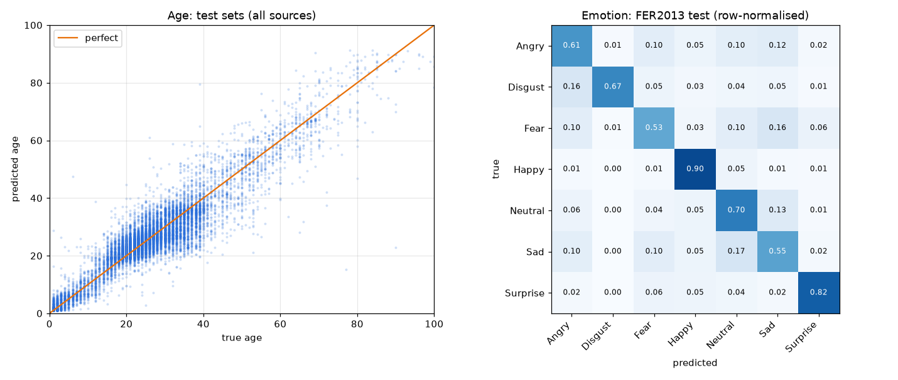

# Face Estimation: Age, Gender & Emotion

Real-time face analysis that predicts **age**, **gender**, and **facial expression** from an image, a video, or a webcam.
Faces are found with OpenCV's YuNet detector. Each face then goes through two fine-tuned EfficientNetV2-B0 networks: a multi-task age+gender model trained on four face datasets (UTKFace, AFAD, MegaAge-Asian, APPA-REAL), and an expression model trained on FER2013.

## Results (held-out test sets)

**Age and gender.** The test images come from 4 sources and none were used in training.

| Test set | Images | v2: trained on UTKFace only (MAE) | **v3: trained on 4 datasets (MAE)** | v3 within ±5 years |
|---|---|---|---|---|
| UTKFace (mixed ethnicity) | 2,371 | 4.79 | **4.41** | 68% |
| AFAD (Asian, 15–72) | 6,001 | 7.39 | **3.27** | 79% |
| MegaAge-Asian (0–70) | 3,937 | 5.29 | **2.89** | 83% |
| APPA-REAL (in-the-wild photos) | 746 | 8.52 | **5.17** | 61% |
| **All sources** | 13,055 | 6.35 | **3.47** | 77% |
| Simulated webcam (56 px face, JPEG q50) | 13,055 | 6.96 | **4.50** | – |

- Gender accuracy (UTKFace + AFAD test sets) is **97.7%**, up from 90.5% for v2.
- Average bias is about 0 (−0.03 years), so v3 does not systematically predict too young or too old.
- Age error by group (years): 0–12: 1.7, 13–19: 3.3, **20–29: 2.7**, 30–39: 4.8, 40–49: 6.5, 50–59: 6.0, 60–69: 5.7, 70+: 8.0.

v2 trained on UTKFace alone and reached 4.55 years MAE on UTKFace's own test split. It generalised poorly to other photo sources and to real webcams: it guessed 16 for a 26-year-old user. Training on more diverse data (60k AFAD, 36k MegaAge, 6k APPA-REAL plus UTKFace), with every image re-cropped by the same detector used at inference and with low-quality-camera augmentation, fixed this.

**Emotion.** On the FER2013 official test set (7,178 images), accuracy is **70.2%** and macro-F1 0.69. For reference, human accuracy on FER2013 is about 65%, and published state-of-the-art results are 73–76%.



## What was wrong in v1 and how it was fixed

| Problem in v1 | Effect | Fix |
|---|---|---|
| `train_size = int(0.8 * len(dataset))` used the **number of batches** as if it were the number of images | The age model trained on only ~2.5% of the data, and only on ages 20–42 ([histogram](history/legacy_v1/age_distribution_v1.png)). It overfit badly and could not predict children or older people. | Reproducible stratified 80/10/10 split by age and gender (`utils/data.py`) |
| The age-normalised dataset class in `train_age.py` was never used, and inference guessed a rescale (`if age < 1.5: age *= 100`) | Wrong ages | Age head is a softmax over 0–100 with the expected value as output (DEX-style), so the output is always in years |
| Emotion labels at inference (`…Sad, Surprise, Neutral`) did not match the alphabetical training order (`…Neutral, Sad, Surprise`) | Neutral was shown as Sad, Sad as Surprise, Surprise as Neutral | One label list in `utils/config.py`, plus a unit test for the order |
| Training used RGB images but inference passed BGR crops. EfficientNet inputs were divided by 255 twice. Faces were 64 px. | Predictions were skewed | One shared preprocessing function (`to_model_input`), RGB in [0, 255] with normalisation inside the model, 160 px (age/gender) and 112 px (emotion) |
| Only one small dataset (UTKFace, 19k images) | Poor accuracy on other photo sources and real webcams | 4 datasets (~109k training faces), all re-cropped with the inference detector, plus webcam-quality augmentation |
| Small CNNs trained from scratch; Haar cascade detector | Low accuracy, missed faces | ImageNet-pretrained EfficientNetV2-B0 with two-phase fine-tuning, augmentation, label smoothing and AdamW; YuNet detector with crop size calibrated on the training data |
| Invalid path `"\data\1.jpg"`, duplicated predictor classes, hard-coded Windows paths, CI running `pytest` with no tests | Did not run; CI always failed | Clean CLI, one `FaceAnalyzer` class, and unit tests that run in CI |

## Installation

```bash
git clone https://github.com/yoonjae26/face_estimation.git
cd face_estimation
python -m venv venv && source venv/bin/activate   # Windows: venv\Scripts\activate
pip install -r requirements.txt
```

The trained models are included in `models/` (about 25 MB each), so you can run inference right away.

## Usage

```bash
python main.py --image photo.jpg --output result.jpg   # analyse an image
python main.py --webcam                                 # real-time (q = quit, s = screenshot)
python main.py --video clip.mp4 --output out.mp4        # annotate a video
python main.py --image photo.jpg --no-show              # headless (servers)
```

Add `--no-tta` for faster inference. It turns off flip test-time augmentation, which costs a little accuracy.

**Webcam when the code runs on a remote server** (e.g. VS Code Remote-SSH): run `python webcam_app.py` and open
http://localhost:8000 in your local browser. The browser streams your webcam to the server and draws the live predictions.
VS Code forwards the port automatically; otherwise use `ssh -L 8000:localhost:8000 user@server`.

To try the models quickly, run `demo.py`. It samples random held-out test images, prints the predictions next to the ground truth, and saves image grids to `demo_results/`:

```bash
python demo.py                          # 12 UTKFace + 12 FER2013 test images
python demo.py --dataset utkface -n 24 --seed 3
python demo.py --images my_photos/      # your own photos (file or folder)
```

From Python:

```python
import cv2
from utils.predictor import FaceAnalyzer

analyzer = FaceAnalyzer()
for face in analyzer.analyze(cv2.imread("photo.jpg")):
    print(face["box"], face["age"], face["gender"], face["emotion"], face["emotion_probs"])
```

## Training

1. Download the datasets into `data/` (needs a Kaggle API token):

   ```bash
   kaggle datasets download -d jangedoo/utkface-new -p data && unzip -q data/utkface-new.zip -d data/utkface
   kaggle datasets download -d lyk1652/afad-full -p data && unzip -q data/afad-full.zip -d data/afad
   kaggle datasets download -d baopmessi/megaage -p data && unzip -q data/megaage.zip -d data/megaage
   kaggle datasets download -d abhikjha/appa-real-face-cropped -p data && unzip -q data/appa-real-face-cropped.zip -d data/appa
   kaggle datasets download -d msambare/fer2013 -p data && unzip -q data/fer2013.zip -d data/fer2013
   ```

2. Re-crop every age/gender image with the inference face detector. This writes `data/age_crops/` and takes a few minutes on CPU:

   ```bash
   python train/prepare_age_data.py
   ```

3. Train and evaluate. On one H200 GPU, age/gender takes about 25 minutes and emotion about 10 minutes.

   ```bash
   python train/train_age_gender.py     # -> models/age_gender_model.keras, history/age_gender/
   python train/train_emotion.py        # -> models/emotion_model.keras,    history/emotion/
   python evaluate.py                   # -> history/test_metrics.json, history/test_results.png
   ```

   Scripts use GPU 0 by default. Set `CUDA_VISIBLE_DEVICES` to choose a different GPU. GPU memory is allocated on demand.

Training details:
- **Phase 1:** the backbone is frozen and only the new heads train (3 epochs).
- **Phase 2:** the whole network is fine-tuned with AdamW, 1-epoch warmup and cosine decay. The best validation checkpoint is kept, with early stopping.
- **Age/gender:** L1 loss on the expected age plus BCE for gender. Sources without gender labels (MegaAge, APPA-REAL) get zero weight in the gender loss. Training uses strong augmentation, random erasing, and simulated low-quality cameras (downscaling, JPEG artefacts, noise).
- **Emotion:** grayscale input, label smoothing 0.1. Stronger regularisation (MixUp, random erasing) narrowed the train/val gap but scored lower on test (69.4%), so it is off by default. The flags are kept in `train/train_emotion.py`.

Training curves: [age/gender](history/age_gender/training_curves.png) · [emotion](history/emotion/training_curves.png).
The v1 training logs are in `history/legacy_v1/`.

## Project structure

```
main.py                   CLI demo (image / video / webcam)
evaluate.py               test-set evaluation + plots
utils/config.py           paths, image sizes, label lists, crop calibration
utils/data.py             dataset parsing, splits, tf.data pipelines + augmentation
utils/models.py           model definitions
utils/face_detector.py    YuNet/Haar detection, square cropping, preprocessing
utils/predictor.py        FaceAnalyzer (detect → crop → predict) + drawing
train/                    data preparation, training scripts, crop-size calibration
tests/                    unit tests (run in CI)
models/                   trained models + YuNet detector
```

## Limitations

- Emotion recognition from a single frame is noisy. FER2013 itself has label noise, and Fear and Sad are often confused (see the confusion matrix).
- Gender is predicted as binary, following the dataset annotations.
- Age is hardest for people over 40 (error of about 6 years), because the training data has far fewer of them. Apparent age also varies with lighting, make-up and expression, so read a single webcam estimate as roughly ±4 years.
- Accuracy drops on faces unlike the training data: strong profile views, heavy occlusion, very low resolution.

## Data and license

The code is released under the MIT License (see `LICENSE`). The models were trained on
[UTKFace](https://susanqq.github.io/UTKFace/), [AFAD](https://afad-dataset.github.io/),
[MegaAge-Asian](http://mmlab.ie.cuhk.edu.hk/projects/MegaAge/), [APPA-REAL](https://chalearnlap.cvc.uab.cat/dataset/26/description/)
and [FER2013](https://www.kaggle.com/datasets/msambare/fer2013). Most of these are for non-commercial research only, and use of the trained weights is subject to those datasets' terms.
The YuNet detector comes from [OpenCV Zoo](https://github.com/opencv/opencv_zoo) (MIT).
