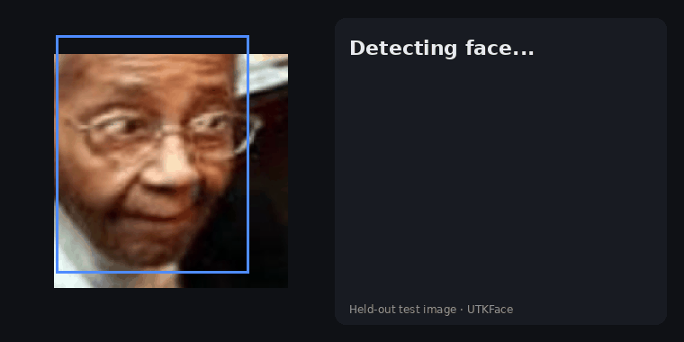
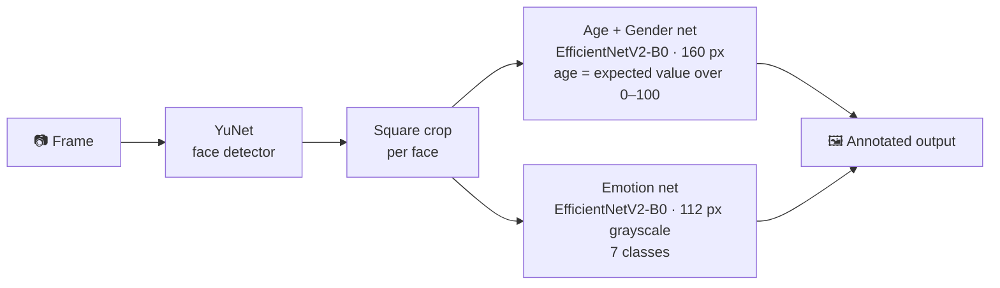
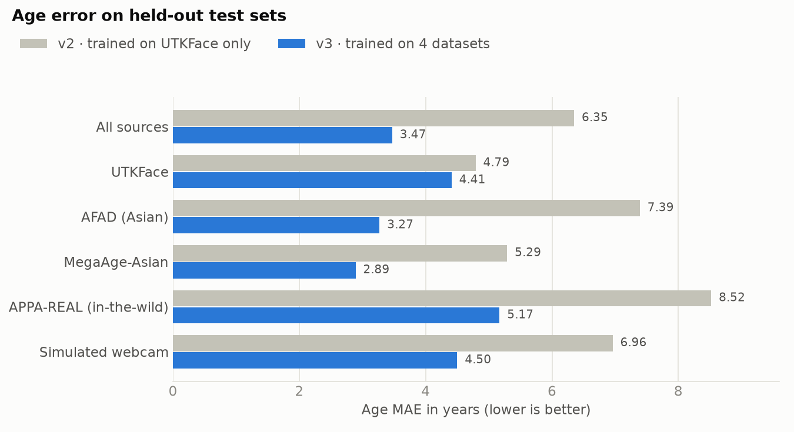

<div align="center">

# 🧑 Face Estimation

**Real-time age, gender and emotion recognition from a webcam, a video or a photo.**

[](https://github.com/yoonjae26/face_estimation/actions/workflows/python-app.yml)




<sub>Random held-out test faces (UTKFace, MegaAge-Asian, APPA-REAL) run through the full pipeline, each prediction shown next to its ground truth. Rebuild with <code>python docs/make_demo_gif.py</code>.</sub>

| Age error | Gender accuracy | Emotion accuracy | Speed (1 GPU) |
|:---:|:---:|:---:|:---:|
| **3.5 years** MAE | **97.7%** | **70.2%** (FER2013) | **~20 FPS** |

</div>

---

## ✨ Highlights

- **Accurate on real-world faces.** The age/gender model is trained on four datasets (~109k faces): UTKFace, AFAD, MegaAge-Asian and APPA-REAL. Training adds simulated low-quality-camera noise, so it holds up on webcams, not just on clean dataset photos.
- **Training matches inference.** Every training image is re-cropped with the same face detector used at run time.
- **Runs anywhere:** a desktop webcam, a remote GPU server through your browser, a video file or a single image.
- **Reproducible:** one script per step, fixed seeds, held-out test sets, and CI with unit tests.

## 🔍 How it works



- **Age** is predicted as a probability distribution over ages 0–100. The output is its expected value (DEX-style), which is more stable than plain regression.
- **Flip test-time augmentation** averages each prediction with the prediction for the mirrored face.

## 📊 Results

All numbers come from **held-out test images never used in training**.

<p align="center"></p>

| Task | Test set | Result |
|---|---|---|
| Age | 13,055 faces from 4 sources | **MAE 3.47 years**; 77% of predictions within ±5 years; bias −0.03 years |
| Age by group | same | 0–12: 1.7 · 13–19: 3.3 · **20–29: 2.7** · 30–39: 4.8 · 40–49: 6.5 · 50–59: 6.0 · 60–69: 5.7 · 70+: 8.0 |
| Gender | UTKFace + AFAD (8,372 faces) | **97.7%** accuracy |
| Emotion | FER2013 official test (7,178 faces) | **70.2%** accuracy, macro-F1 0.69 (humans reach ~65%, published state of the art is 73–76%) |

<details>
<summary><b>Predicted vs. true age and the emotion confusion matrix</b></summary>
<br>


Training curves: [age/gender](history/age_gender/training_curves.png) · [emotion](history/emotion/training_curves.png)
</details>

## 🚀 Quick start

```bash
git clone https://github.com/yoonjae26/face_estimation.git
cd face_estimation
python -m venv venv && source venv/bin/activate   # Windows: venv\Scripts\activate
pip install -r requirements.txt
```

The trained models are already included in `models/` (~25 MB each), so no download is needed.

### Webcam on your own computer

```bash
python main.py --webcam            # q = quit, s = screenshot
```

### Webcam when the code runs on a remote GPU server

```bash
python webcam_app.py               # then open http://localhost:8000 in your browser
```

Your browser sends webcam frames to the server and draws the live predictions. VS Code Remote-SSH forwards the port automatically; otherwise use `ssh -L 8000:localhost:8000 user@server`. Click **Record 6 s GIF** to save a clip of your own webcam session to `docs/demo.gif`.

### Photos and videos

```bash
python main.py --image photo.jpg --output result.jpg
python main.py --video clip.mp4 --output result.mp4 --no-show
python demo.py                     # random test images: prediction vs. ground truth
python demo.py --images my_photos/ # a whole folder of your photos
```

### From Python

```python
import cv2
from utils.predictor import FaceAnalyzer

analyzer = FaceAnalyzer()
for face in analyzer.analyze(cv2.imread("photo.jpg")):
    print(face["box"], round(face["age"]), face["gender"], face["emotion"], face["emotion_probs"])
```

## 🏋️ Training

<details>
<summary><b>Reproduce the models</b> (about 35 minutes on one GPU)</summary>

1. **Download the datasets** into `data/`. You need a Kaggle API token.

   ```bash
   kaggle datasets download -d jangedoo/utkface-new -p data && unzip -q data/utkface-new.zip -d data/utkface
   kaggle datasets download -d lyk1652/afad-full -p data && unzip -q data/afad-full.zip -d data/afad
   kaggle datasets download -d baopmessi/megaage -p data && unzip -q data/megaage.zip -d data/megaage
   kaggle datasets download -d abhikjha/appa-real-face-cropped -p data && unzip -q data/appa-real-face-cropped.zip -d data/appa
   kaggle datasets download -d msambare/fer2013 -p data && unzip -q data/fer2013.zip -d data/fer2013
   ```

2. **Re-crop the age/gender images** with the inference face detector. This writes `data/age_crops/` and takes a few minutes on CPU.

   ```bash
   python train/prepare_age_data.py
   ```

3. **Train and evaluate.**

   ```bash
   python train/train_age_gender.py   # ~25 min -> models/age_gender_model.keras
   python train/train_emotion.py      # ~10 min -> models/emotion_model.keras
   python evaluate.py                 # -> history/test_metrics.json, history/test_results.png
   ```

   The scripts use GPU 0 by default and allocate GPU memory on demand. Set `CUDA_VISIBLE_DEVICES` to pick another GPU.

**Recipe**
- **Phase 1:** the ImageNet-pretrained backbone is frozen and only the new heads train (3 epochs).
- **Phase 2:** the whole network is fine-tuned with AdamW, 1-epoch warmup, cosine decay and early stopping on the validation set.
- **Age/gender:** L1 loss on the expected age plus BCE for gender. The gender loss is masked for sources without gender labels. Augmentation includes flips, rotation, zoom, colour, random erasing and simulated low-quality cameras (downscaling, JPEG, noise).
- **Emotion:** grayscale input with label smoothing 0.1. Stronger regularisation (MixUp, random erasing) narrowed the train/val gap but scored lower on test, so it is off by default.
</details>

## 🛠️ Project history: what was fixed

<details>
<summary><b>v1 → v3 changelog</b></summary>

| Problem | Effect | Fix |
|---|---|---|
| `train_size = int(0.8 * len(dataset))` counted **batches** as images | The v1 age model trained on ~2.5% of the data, only ages 20–42 ([histogram](history/legacy_v1/age_distribution_v1.png)) | Stratified 80/10/10 split |
| Emotion labels at inference didn't match the alphabetical training order | Neutral was shown as Sad, Sad as Surprise, Surprise as Neutral | One label list in `utils/config.py` plus a unit test |
| BGR/RGB mismatch, inputs divided by 255 twice, 64 px faces | Skewed predictions | One shared preprocessing path, larger inputs |
| Only UTKFace (v2) | Real webcam users were off by ~10 years; MAE 7–8.5 on other sources | 4 datasets, detector-consistent crops, webcam augmentation (v3) |
| Small CNNs from scratch, Haar cascade detector | Low accuracy, missed faces | Pretrained EfficientNetV2 with two-phase fine-tuning; YuNet detector |
| Broken paths, duplicate classes, CI with no tests | Did not run | Clean CLI, one `FaceAnalyzer` class, tests in CI |

The v1 training logs are kept in `history/legacy_v1/`.
</details>

## 📁 Project structure

```
main.py                 CLI: image / video / local webcam
webcam_app.py           browser-based live demo (remote servers) + GIF recorder
demo.py                 predictions vs. ground truth on test images, or your own photos
evaluate.py             test-set metrics and plots
utils/                  config, data pipelines, models, face detection, FaceAnalyzer
train/                  data preparation, training scripts, crop calibration
tests/                  unit tests (run in CI)
models/                 trained models + YuNet face detector
docs/                   README images + make_demo_gif.py
```

## ⚠️ Limitations

- Apparent age depends on lighting, make-up, expression and camera. Treat a single estimate as roughly **±4 years**. People over 40 are harder (~6 years error) because the training data has fewer of them.
- Emotion from a single frame is noisy. Fear and Sad are often confused, partly because FER2013 itself has label noise.
- Gender is binary, following the dataset annotations.
- Strong profile views, heavy occlusion and very small faces reduce accuracy.

## 📄 Data and license

The code is released under the [MIT License](LICENSE). The models were trained on
[UTKFace](https://susanqq.github.io/UTKFace/), [AFAD](https://afad-dataset.github.io/),
[MegaAge-Asian](http://mmlab.ie.cuhk.edu.hk/projects/MegaAge/), [APPA-REAL](https://chalearnlap.cvc.uab.cat/dataset/26/description/)
and [FER2013](https://www.kaggle.com/datasets/msambare/fer2013). Most of these datasets are for **non-commercial research only**, and use of the trained weights is subject to their terms.
The face detector is [YuNet](https://github.com/opencv/opencv_zoo) from OpenCV Zoo (MIT).
